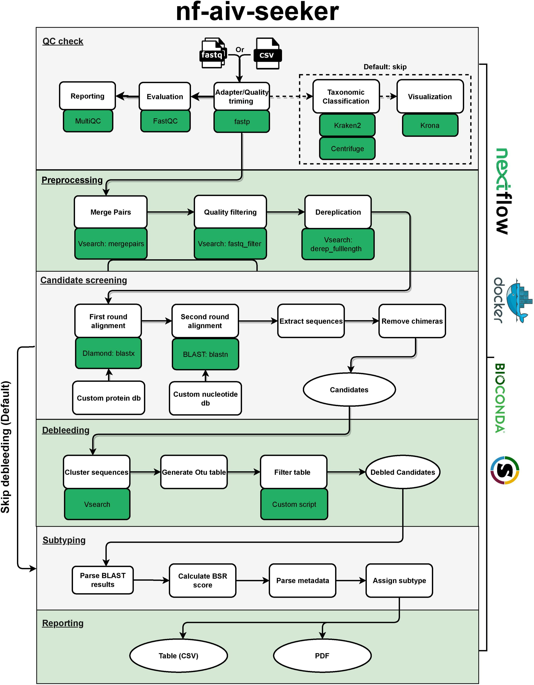

# nf-aivseeker

## Introduction

The application of next generation sequencing (NGS) in infectious disease surveillance and outbreak investigations has become a promising area. Environmental sampling provides a method to collect and identify potentially dangerous pathogens that are circulating in an animal population, however detection of a low-abundance pathogen target in a large metagenomic background is still a challenge. **AIV_seeker** pipeline that is optimized for detecting and identifying low-abundance avian influenza virus (AIV) from metagenomic NGS data.

The workfow was originally built in Perl, but now we decided to switch to [Nextflow](https://www.nextflow.io)-[DSL2](https://www.nextflow.io/docs/latest/dsl2.html) as workflow engine starting from version 0.3. Nextflow makes the pipeline more scalable and reproducible. It's easy to run tasks across multiple compute infrastructures, and also it can support `conda`/`Docker`/`Singularity` containers making installation trivial and results highly reproducible. 

A detailed structure and each module of the workflow is presented below in the dataflow diagram.

## Pipeline summary

## Support

For further information or help, don't hesitate to get in touch at 
[jun_duan@sfu.ca](mailto:jun_duan@sfu.ca) or [wwshiao@sfu.ca](mailto:wwshiao@sfu.ca)

## Citations
An extensive list of references for the tools used by the workflow 
can be found in the [CITATIONS.md](https://github.com/cidgoh/AIV_seeker/blob/master/docs/CITATIONS.md) file.
